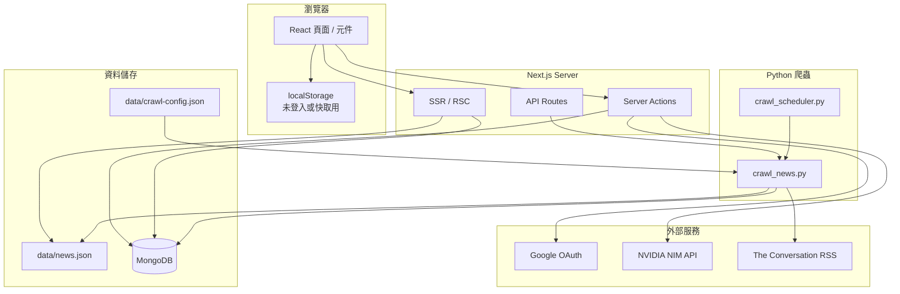

# Intelligence News — 技術文件

> 面向開發與維運人員的系統說明。最後更新：2026-06-13

## 1. 專案概述

**Intelligence News** 是以時事新聞輔助英文學習的 Web 應用。主要資料來源為 [The Conversation (US)](https://theconversation.com/us) RSS，搭配 **NVIDIA NIM API** 提供 AI 摘要、測驗與口說練習（需登入）。

| 項目 | 說明 |
|------|------|
| 正式環境 | `https://intelligence-news.ntubimdbirc.tw` |
| 框架 | Next.js 16（App Router）、React 19 |
| 語言 | TypeScript（前端/後端）、Python 3（爬蟲） |
| 驗證 | NextAuth v5 + Google OAuth |
| 資料庫 | MongoDB Atlas |
| AI | NVIDIA NIM（OpenAI 相容 API，預設 `meta/llama-3.1-8b-instruct`） |

所有登入使用者享有相同額度：**每日 3 篇 AI 文章**（摘要與測驗合計）、**最多 4 個新聞標籤**。

---

## 2. 系統架構



### 2.1 新聞資料解析優先順序

`lib/news/resolve.ts` 決定前端可見的新聞來源，優先順序如下：

1. **`data/news.json`** — 爬蟲輸出；僅保留 `theconversation.com` 來源
2. **MongoDB `news` collection** — 同上過濾
3. **`lib/news/static.ts`** — 內建靜態備援資料

若 JSON 與 DB 皆無有效資料，才回退至靜態文章。

### 2.2 全域客戶端背景任務

`components/Providers.tsx` 包裹 `AppShell`，在每次頁面載入時執行：

| 元件 / Hook | 用途 |
|-------------|------|
| `UserBookmarksSync` | 登入後將 MongoDB 書籤合併至 localStorage |
| `useNewsNotifications` | 每 5 分鐘（及視窗 focus）比對 `getNewsSnapshot()`，偵測符合標籤的新文章並寫入通知 |

---

## 3. 目錄結構

```
news_app/
├── app/                    # Next.js App Router
│   ├── actions/            # Server Actions（AI、使用者、新聞等）
│   │   ├── ai.ts           # 摘要、測驗
│   │   ├── article.ts      # 抓取原文 HTML
│   │   ├── auth.ts         # 登出
│   │   ├── channel.ts      # AI 討論、口說回饋
│   │   ├── news.ts         # 新聞快照、依 ID 查詢
│   │   └── user.ts         # 個人設定、書籤、AI 用量
│   ├── api/
│   │   ├── auth/[...nextauth]/   # NextAuth 路由
│   │   └── crawl/                # 遠端觸發爬蟲
│   ├── article/[id]/       # 文章詳情
│   ├── channel/            # 收藏文章的 AI 討論 / 口說
│   ├── explore/[topic]/    # 依標籤探索
│   ├── login/              # Google 登入
│   ├── profile/            # 個人設定
│   ├── words/              # 我的收藏
│   ├── notifications/      # 通知
│   ├── auth.ts             # NextAuth 設定
│   └── layout.tsx
├── components/             # React 元件
├── hooks/                  # 客戶端 Hooks
│   ├── useAIArticleAccess.ts   # AI 額度檢查
│   ├── useAISummaryCache.ts    # 摘要 localStorage 快取
│   ├── useNewsNotifications.ts # 新文章通知
│   ├── useNotifications.ts     # 通知列表
│   ├── useSpeechRecognition.ts # 語音輸入
│   └── useUserSettings.ts      # 使用者設定
├── lib/                    # 核心邏輯
│   ├── ai/                 # AI 錯誤、摘要、匯出
│   ├── auth/               # Auth URL 正規化
│   ├── crawl/              # 爬蟲設定與執行
│   ├── db/                 # MongoDB 連線
│   ├── copy.ts             # 介面文案
│   ├── news/               # 新聞讀取、持久化、快照
│   ├── tags/               # 標籤 / 主題對應
│   ├── user/               # 使用者設定、用量限制
│   └── types/              # 共用型別
├── data/
│   ├── news.json           # 爬蟲輸出（執行時產生/更新）
│   ├── crawl-config.json   # 要爬取的標籤清單
│   └── conversation-feeds.json  # The Conversation RSS 對照表
├── scripts/
│   ├── crawl_news.py       # 主爬蟲
│   ├── crawl_scheduler.py  # 定時執行
│   └── requirements.txt    # Python 依賴
├── deploy/
│   └── nginx.example.conf  # 反向代理範例
└── types/                  # 全域型別擴充（next-auth 等）
```

> **注意**：部分舊路徑（如 `lib/user-profile-db.ts`、`lib/data.ts`、`lib/auth-url.ts`）仍被引用，新程式碼應優先使用 `lib/user/`、`lib/types/`、`lib/auth/` 下的模組。

---

## 4. 環境變數

本機開發請建立 `.env.local`；正式環境於部署平台或 `.env.production` 設定。**切勿將含密鑰的檔案提交至 Git。**

| 變數 | 必填 | 說明 |
|------|------|------|
| `MONGODB_URI` | 是（登入/持久化） | MongoDB 連線字串；DB 名稱取自 URI path 或 `MONGODB_DB` |
| `AUTH_SECRET` | 是 | NextAuth 簽章密鑰（建議 `openssl rand -base64 32`） |
| `AUTH_GOOGLE_ID` | 是 | Google OAuth Client ID |
| `AUTH_GOOGLE_SECRET` | 是 | Google OAuth Client Secret |
| `AUTH_URL` 或 `NEXTAUTH_URL` | 正式環境必填 | **網站 origin**，例如 `https://intelligence-news.ntubimdbirc.tw`（不含 `/api/auth`） |
| `NVIDIA_API_KEY` | AI 功能 | [build.nvidia.com](https://build.nvidia.com) 取得的 API Key（`nvapi-` 開頭） |
| `NVIDIA_NIM_MODEL` | 否 | 模型名稱，預設 `meta/llama-3.1-8b-instruct` |
| `NVIDIA_NIM_BASE_URL` | 否 | API 端點，預設 `https://integrate.api.nvidia.com/v1` |
| `NVIDIA_NIM_TIMEOUT_MS` | 否 | NIM API 請求逾時（毫秒），預設 `120000` |
| `CRAWL_API_SECRET` | 遠端爬蟲 | `/api/crawl` Bearer 驗證 |
| `PYTHON_PATH` | 否 | 爬蟲 Python 執行檔路徑，預設 `python` |
| `MONGODB_DB` | 否 | 覆寫 URI 中的資料庫名稱 |
| `CRAWL_INTERVAL_SECONDS` | 否 | 排程器間隔，預設 `3600` |

### 4.1 Google OAuth 設定

1. [Google Cloud Console](https://console.cloud.google.com/) 建立 OAuth 2.0 用戶端
2. **授權重新導向 URI** 設為：
   ```
   {AUTH_URL}/api/auth/callback/google
   ```
3. 若經 Nginx / 反向代理，須正確轉發 `Host`、`X-Forwarded-Proto`（見 `deploy/nginx.example.conf`）

### 4.2 環境變數範例

```env
# .env.local 範例（請替換為實際值）
MONGODB_URI=mongodb+srv://<user>:<password>@<cluster>/<dbname>?appName=...
AUTH_SECRET=<random-base64-string>
AUTH_GOOGLE_ID=<google-client-id>
AUTH_GOOGLE_SECRET=<google-client-secret>
AUTH_URL=http://localhost:3000
NVIDIA_API_KEY=<nvapi-key>
NVIDIA_NIM_MODEL=meta/llama-3.1-8b-instruct
CRAWL_API_SECRET=<random-crawl-secret>
```

---

## 5. 本機開發

### 5.1 前置需求

- Node.js 20+
- Python 3.10+
- MongoDB Atlas 或本機 MongoDB（可選；無 DB 時部分功能降級）

### 5.2 安裝與啟動

```bash
# 安裝 Node 依賴
npm install

# 安裝 Python 爬蟲依賴（首次）
npm run crawl:setup

# 抓取新聞（寫入 data/news.json，可選同步 MongoDB）
npm run crawl

# 開發伺服器
npm run dev
```

預設開啟 `http://localhost:3000`。

### 5.3 NPM Scripts

| 指令 | 說明 |
|------|------|
| `npm run dev` | 開發模式 |
| `npm run build` | 正式建置 |
| `npm run start` | 啟動正式伺服器 |
| `npm run lint` | ESLint |
| `npm run crawl` | 執行 `scripts/crawl_news.py` |
| `npm run crawl:watch` | 定時爬蟲（`crawl_scheduler.py`） |
| `npm run crawl:setup` | `pip install -r scripts/requirements.txt` |

---

## 6. 路由與頁面

| 路徑 | 類型 | 說明 |
|------|------|------|
| `/` | RSC | 探索首頁（`ExploreHome`） |
| `/explore/[topic]` | RSC + Client | 依標籤 slug 篩選文章；未選標籤者由 `TopicAccessGuard` 阻擋 |
| `/article/[id]` | RSC + Client | 文章詳情、AI 摘要/測驗 |
| `/channel` | Client | 收藏文章的 AI 討論 / 口說 |
| `/words` | Client | 我的收藏（書籤文章列表） |
| `/profile` | Client | 考試目標、標籤偏好、AI 用量 |
| `/notifications` | Client | 新文章通知 |
| `/login` | Client | Google 登入 |
| `/api/auth/*` | API | NextAuth 處理 |
| `/api/crawl` | API | 遠端觸發爬蟲（需 secret） |

多數資料頁面設為 `dynamic = 'force-dynamic'`，以確保新聞即時更新。

---

## 7. 驗證與 Session

- **Provider**：Google OAuth
- **Adapter**：`@auth/mongodb-adapter`（使用者、帳號、Session 存 MongoDB）
- **Session 策略**：`database`（非 JWT）
- **設定檔**：`app/auth.ts`
- **登入頁**：`/login`
- **Cookie**：HTTPS 環境使用 `__Secure-` / `__Host-` 前綴

Session callback 會將 MongoDB `user.id` 注入 `session.user.id`，供 Server Actions 識別使用者。

Auth URL 正規化邏輯位於 `lib/auth/url.ts`（由 `lib/auth-url.ts` re-export），會將 `AUTH_URL` 去除 path，只保留 origin。

---

## 8. MongoDB Collections

| Collection | 用途 | 主要欄位 |
|------------|------|----------|
| `users` | NextAuth 使用者 | `_id`, `email`, `name`, `image` |
| `accounts` | OAuth 帳號連結 | `userId`, `provider`, `providerAccountId` |
| `sessions` | Session 記錄 | `userId`, `sessionToken`, `expires` |
| `user_profiles` | 使用者偏好與用量 | `userId`, `tagPreferences`, `bookmarks`, `aiUsage`, `aiSummaries` |
| `news` | 新聞文章（可選） | 同 `NewsArticle` 結構 |

### 8.1 `user_profiles` 文件結構（摘要）

```typescript
interface UserProfileDocument {
  userId: string;
  email?: string | null;
  examType: 'IELTS' | 'TOEFL' | 'TOEIC';
  examScores: { TOEIC: string; IELTS: string; TOEFL: string };
  tagPreferences: string[];      // slug，如 'arts', 'business'
  topicPreferences: Topic[];     // 衍生欄位，保留相容
  bookmarks: string[];           // article id
  aiUsage: { date: string; articleIds: string[] };
  aiSummaries?: Record<string, AISummaryCacheEntry>;
  updatedAt: Date;
}
```

> 舊版資料可能仍含 `plan` 欄位；讀取時忽略，儲存時以 `$unset` 清除。

---

## 9. 使用者設定：雙層儲存

| 儲存位置 | 時機 | 內容 |
|----------|------|------|
| `localStorage` | 永遠（客戶端） | 標籤、書籤、AI 用量、摘要快取 |
| MongoDB `user_profiles` | 登入後 | 同上，Server Actions 同步 |

- 未登入：僅 `localStorage`；AI 功能需登入才能使用
- 登入後：`UserBookmarksSync` 等元件會將 DB 資料合併至 localStorage
- AI 用量以**日**為單位重置（`todayKey()` = ISO 日期 `YYYY-MM-DD`）

### 9.1 用量限制

所有使用者相同，定義於 `lib/user/types.ts`：

| 項目 | 常數 / 函式 | 值 |
|------|-------------|-----|
| 每日 AI 文章數（摘要+測驗合計） | `DAILY_AI_ARTICLES` / `getDailyAILimit()` | **3** |
| 可選標籤數 | `MAX_TAGS` / `getMaxTags()` | **4** |

核心函式：

- `canUseAI(articleId, usage)` — 檢查是否可對該文章使用 AI（同一文章當日重複使用不計次）
- `clampTagPreferences(tags)` — 裁切至最多 4 個有效 slug
- `useAIArticleAccess(articleId)` — 客戶端 Hook，整合檢查與用量記錄

---

## 10. Server Actions

所有 Actions 位於 `app/actions/`，標記 `'use server'`。

| 模組 | 主要函式 | 說明 |
|------|----------|------|
| `ai.ts` | `generateSummary`, `generateQuiz` | NVIDIA NIM 摘要與測驗；**需登入** |
| `channel.ts` | `channelDiscuss`, `channelOralFeedback` | 收藏文章 AI 討論 / 口說回饋 |
| `user.ts` | `loadUserProfile`, `persistUserProfile`, `syncCrawlPreferences` | 個人設定 CRUD、同步爬蟲標籤 |
| `user.ts` | `toggleBookmarkInDb`, `recordAIUsageInDb`, `loadAIUsageFromDb` | 書籤與 AI 用量 |
| `user.ts` | `loadAISummariesFromDb`, `persistAISummaryToDb` | AI 摘要雲端同步 |
| `news.ts` | `getNewsSnapshot`, `getNewsByIds` | 新聞快照（供通知用）、依 ID 查詢 |
| `article.ts` | `fetchArticleBody` | 抓取原文 HTML |
| `auth.ts` | `logoutAction` | 登出 |

### 10.1 開發約定

- **Server Action 回傳值**必須為可序列化的純 JSON（字串、數字、物件、陣列）；不可回傳函式、Date 物件（需轉字串）等
- **不可從 `'use server'` 檔案 `export type`**：型別 re-export 可能被 Next.js 編譯成執行期引用，導致 `ReferenceError: X is not defined`。型別請定義在 `lib/`，例如 `NewsSnapshot` 定義於 `lib/news/snapshot.ts`
- **Hydration**：Server HTML 與 Client 初次 render 必須一致。避免在 SSR 讀取 `localStorage`；`layout.tsx` 的 `<body>` 已設 `suppressHydrationWarning` 以容忍瀏覽器擴充套件修改 DOM

---

## 11. API Routes

### 11.1 `POST/GET /api/crawl`

遠端觸發 Python 爬蟲，最長執行 300 秒（`maxDuration = 300`）。

**驗證**（擇一）：

```http
Authorization: Bearer <CRAWL_API_SECRET>
```

或 query：`?secret=<CRAWL_API_SECRET>`

**成功回應**：

```json
{
  "ok": true,
  "articleCount": 72,
  "crawledAt": "2026-06-13T12:00:00.000Z",
  "output": "..."
}
```

執行後會 `revalidatePath('/')` 與 `revalidatePath('/explore', 'layout')`。

---

## 12. 爬蟲系統

### 12.1 流程

1. 讀取 `data/crawl-config.json` 的 `tags`（或使用者 Profile 同步的標籤）
2. 依 `data/conversation-feeds.json` 對應 RSS URL
3. 每個標籤抓取最多 8 篇（`ARTICLES_PER_TOPIC`）
4. 解析 RSS + 文章頁 HTML（標題、摘要、全文、圖片）
5. 寫入 `data/news.json`
6. 若設 `MONGODB_URI`，全量替換 `news` collection

Node 端透過 `lib/crawl/run.ts` 的 `runCrawlScript()` 以 `execFile` 呼叫 Python；`/api/crawl` 與本機 `npm run crawl` 共用此流程。

### 12.2 標籤 slug 對照

| slug | Topic |
|------|-------|
| `arts` | Arts + Culture |
| `business` | Business & Economy |
| `education` | Education |
| `environment` | Environment & Energy |
| `ethics` | Ethics & Religion |
| `health` | Health |
| `politics` | Politics & Society |
| `technology` | Science & Tech |
| `world` | World |

定義於 `lib/tags/conversation.ts`、`data/conversation-feeds.json`。

### 12.3 定時執行

```bash
# 本機：每 3600 秒執行一次
npm run crawl:watch

# 或 cron / systemd timer 呼叫
curl -X POST -H "Authorization: Bearer $CRAWL_API_SECRET" \
  https://intelligence-news.ntubimdbirc.tw/api/crawl
```

---

## 13. AI 整合

| 項目 | 值 |
|------|-----|
| 提供者 | NVIDIA NIM（OpenAI 相容 Chat Completions API） |
| 端點 | `https://integrate.api.nvidia.com/v1/chat/completions` |
| 預設模型 | `meta/llama-3.1-8b-instruct`（可透過 `NVIDIA_NIM_MODEL` 覆寫） |
| 實作 | `lib/ai/nim.ts` |

功能（**皆需登入**，未登入時客戶端顯示登入提示）：

- **摘要**（`generateSummary`）：英文摘要 + 繁中說明、重點條列
- **測驗**（`generateQuiz`）：選擇題，依 IELTS/TOEFL/TOEIC 程度調整
- **Channel 討論**（`channelDiscuss`）：僅限已收藏文章
- **口說回饋**（`channelOralFeedback`）：語音練習評分與建議

Prompt 會帶入使用者 `examType` 與 `examScores`，非英文學習欄位固定使用繁體中文。結構化回應（JSON）透過 prompt 要求模型輸出，並以 `extractJsonFromText()` 解析。

摘要快取：客戶端 `localStorage`（`user_ai_summaries`）+ 登入後 MongoDB `user_profiles.aiSummaries`。

AI 額度在客戶端以 `useAIArticleAccess` 檢查，並同步寫入 localStorage 與 MongoDB `aiUsage`；同一篇文章當日再次使用不重新計次。

---

## 14. 核心型別

定義於 `lib/types/data.ts`：

```typescript
interface NewsArticle {
  id: string;
  topic: Topic;
  tagSlugs?: string[];
  titleEn: string;
  titleZh: string;
  descriptionEn: string;
  descriptionZh: string;
  readTime: string;
  difficulty: 'Easy' | 'Medium' | 'Hard';
  imageUrl: string;
  sourceUrl?: string;
  sourceName?: string;
  fullContentEn?: string;
  publishedAt?: string;
}
```

新聞快照型別 `NewsSnapshot` 定義於 `lib/news/snapshot.ts`（**不要**從 `app/actions/news.ts` import 型別）。

---

## 15. 部署

### 15.1 建置

```bash
npm run build
npm run start   # 預設 port 3000
```

### 15.2 反向代理（Nginx）

參考 `deploy/nginx.example.conf`：

- TLS 終止於 Nginx
- `proxy_set_header Host`、`X-Forwarded-Proto`、`X-Forwarded-For` 必須正確設定
- Google OAuth 依賴正確的 HTTPS 與 Host
- **AI 功能**：Nginx 預設 `proxy_read_timeout` 為 60 秒，大模型推理易逾時導致 **504**。請設為 `300s`（見範例檔）

### 15.3 Vercel / 其他平台

- 設定所有環境變數
- `next.config.ts` 中 `experimental.serverActions.allowedOrigins` 需包含部署網域
- 遠端爬蟲需平台支援子行程（Python）或改由外部 cron 呼叫 `/api/crawl`

### 15.4 正式環境 `AUTH_URL`

`lib/auth/url.ts` 會將 URL **正規化為 origin**（去除 path）。請設定：

```
AUTH_URL=https://intelligence-news.ntubimdbirc.tw
```

**不要**加上 `/api/auth` 後綴。

---

## 16. 圖片與外部資源

`next.config.ts` 允許的遠端圖片網域：

- `images.unsplash.com`
- `images.theconversation.com` / `**.theconversation.com`
- `lh3.googleusercontent.com`（Google 頭像）

---

## 17. 疑難排解

| 現象 | 可能原因 | 處理方式 |
|------|----------|----------|
| `NewsSnapshot is not defined` | Server Action 檔案 re-export 型別 | 型別只放在 `lib/`，Action 檔僅 export async 函式 |
| Google 登入 redirect 錯誤 | `AUTH_URL` 或 Google Console redirect URI 不符 | 確認 origin 與 `/api/auth/callback/google` |
| `/api/auth/session` 404 連鎖錯誤 | 上述 Server Action 模組載入失敗 | 修正 Action 模組錯誤後重啟 dev server |
| 登入後設定未保存 | `MONGODB_URI` 未設定或連線失敗 | 檢查 Atlas IP 白名單、連線字串 |
| AI 回傳 504 / 逾時 | Nginx 60s 逾時或模型太大（如 70B） | 拉長 `proxy_read_timeout`；改用 `meta/llama-3.1-8b-instruct` |
| AI 功能報錯 | `NVIDIA_API_KEY` 缺失或配額用盡 | 至 build.nvidia.com 取得 Key 並設定環境變數 |
| 今日 AI 額度已用完 | 當日已對 3 篇不同文章使用 AI | 等待隔日重置，或對已用過的文章重複生成（不計次） |
| 首頁無新聞 | 未執行爬蟲或 JSON 為空 | `npm run crawl` 或呼叫 `/api/crawl` |
| Hydration Error | SSR/CSR 渲染不一致 | 避免 SSR 使用 `window`/`localStorage` |
| 爬蟲 MongoDB 同步失敗 | 未安裝 pymongo | `npm run crawl:setup` |
| Build 時 MongoDB 錯誤 | 連線在 import 時觸發 | `lib/db/index.ts` 已延遲連線；確認 build 環境變數 |

---

## 18. 相關文件

- Next.js 16 官方文件：請參考 `node_modules/next/dist/docs/`（本專案使用之 Next.js 版本可能與訓練資料不同）
- `AGENTS.md`：AI 代理開發規則
- `deploy/nginx.example.conf`：Nginx 設定範例

---

## 19. 安全性提醒

- 所有 API Key、OAuth Secret、`CRAWL_API_SECRET` 僅存於環境變數
- `/api/crawl` 必須設定強隨機 secret，避免公開觸發
- MongoDB Atlas 應限制 IP 白名單與最小權限帳號
- AI 用量在客戶端有 localStorage 副本；以 MongoDB `aiUsage` 為登入使用者的權威來源
